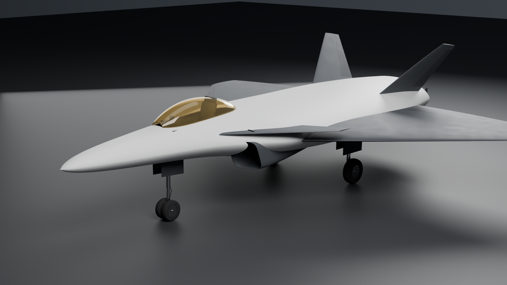
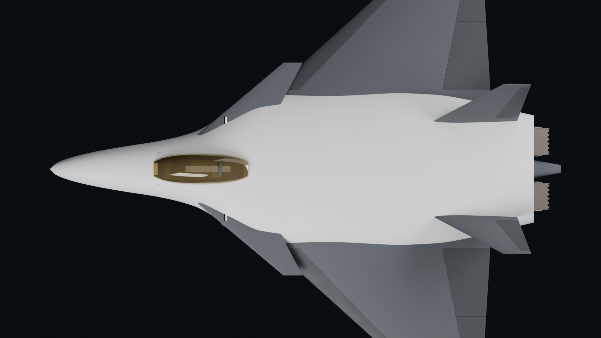
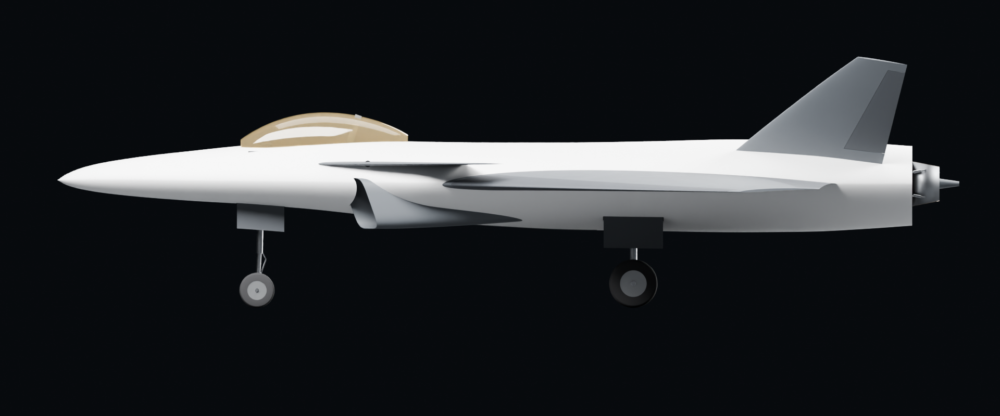

# Nyx — a twin-engine canard-delta agile fighter

An original fighter designed for one thing: turning. It is short, wide and
lightly loaded; it is unstable in pitch on purpose; and it carries two
[Aether AX-1](https://github.com/Krabduke/aether-ax1) adaptive-cycle engines
with two-dimensional vectoring nozzles. The whole aircraft is generated
procedurally in Blender from one specification file, and every number below
is computed by the code in this repository, not typed in.

This is **version 2** of the aircraft project. Version 1 — a single-engine
jet built around the GE F110 — is kept at
[Krabduke/rc-jet](https://github.com/Krabduke/rc-jet) (tag `v1`).



| | |
|---|---|
|  |  |

## Why this shape

The brief was agility over top speed. Each choice follows from it.

- **Low wing loading.** Turn rate at a given speed is lift over mass, so the
  wing is large for the aircraft's weight: 68 m² on a 17.2 t combat mass,
  252 kg/m² — lower than any current fighter.
- **Thrust.** Two engines of 135 kN each on reheat give a combat
  thrust-to-weight of 1.6, so a hard turn can be held without bleeding speed.
- **Short and wide.** Pitch and yaw inertia grow with length squared. At
  14.9 m long and 13.2 m across, Nyx is almost as wide as it is long, and the
  width goes into a lifting body — the fuselage between the wings makes lift —
  rather than into length.
- **Relaxed stability.** The centre of gravity is 5.6 % of the mean chord
  behind the neutral point, so the aircraft wants to pitch on its own and the
  flight control system only has to let it. That is where instant pitch
  response comes from. Supersonic, the neutral point moves aft and it is
  stable again.
- **Close-coupled canards.** All-moving foreplanes just ahead of and above
  the wing trim the unstable airframe with lift rather than a tail's
  download, and their vortex keeps the wing working at high angle of attack.
- **Thrust vectoring.** The nozzles swing ±20° in pitch, together or
  differentially, which gives control where the surfaces have none — past
  the stall.
- **Stealth shaping that costs no agility.** A chined nose, caret intakes
  with serpentine ducts that hide the engine faces, an internal weapons bay,
  canted fins and sawtooth edges.

## What that buys

From `aero/agility.py`, at combat weight (half fuel, four missiles):

| | Sea level | 15,000 ft |
|---|---|---|
| Instantaneous turn | **35.0 °/s** at 9.5 g, 547 km/h | 27.7 °/s |
| Sustained turn | **26.0 °/s** at 5.4 g | 17.3 °/s |

The sustained figures barely move across a band of zero-lift drag
coefficients (0.016 to 0.022), so they do not rest on one guessed number.

## Specification

| | |
|---|---|
| Length × span | 14.9 × 13.2 m |
| Wing | 68.2 m², aspect ratio 2.55, 48° leading-edge sweep, 5 % thick at the root |
| Combat mass | 17,170 kg (12,820 kg empty) |
| Engines | 2 × Aether AX-1, 90.5 kN dry and 134.9 kN reheat each, 2D vectoring nozzles |
| Thrust / weight | 1.60 at combat weight |
| Static margin | −5.6 % MAC, from a vortex-lattice solve |
| Load limit | 9.5 g |
| Weapons | four medium-range missiles in an internal bay |

## How the numbers hang together

- `nyx/spec.py` holds the outer mould line, the surfaces, the masses and
  their positions.
- `aero/vlm.py` is a vortex-lattice solver over the wing and canards. It is
  validated against lifting-surface theory for an aspect-ratio-8 wing
  (−5.6 %), then used for the lift slope and the neutral point.
- `aero/area_rule.py` integrates the cross-sectional area along the aircraft
  and compares it with the Sears-Haack ideal.
- `aero/agility.py` combines the lift slope with Polhamus vortex lift for
  the maximum lift coefficient, and takes thrust from the vendored engine's
  own cycle, to give the turn rates.

The engine is **vendored**: `aether/` is a checked copy of the Aether AX-1's
source, refreshed with `make vendor`, and `nyx/verify.py` fails if the copy
drifts from the engine repository.

## Build

Requires Blender (`brew install --cask blender`) and Python 3 with numpy.

```
make aero       # area rule, vortex lattice, turn performance
make build      # generate geometry, assemble build/nyx.blend, write parts.csv
make verify     # every gate below  <- the definition of done
make render     # hero, plan, side
make web        # decimated, Draco-compressed GLB for the viewer
```

## The viewer

Serve the repository root (for example `python3 -m http.server`) and open
`/viewer/`. Drag to orbit and hover any part to name it. The page lets you:

- switch between four camera views;
- hide or show each group of parts — the port engine is marked red and the
  starboard green, as the navigation lights are;
- see through the skin to the intake ducts, engines, cockpit and weapons bay.

The dial shows the turn rates above. Every figure on the page comes from
`viewer/parts.json`, which is generated from the build and checked against
it.

## The gates

`make verify` runs nine checks, and all of them pass:

| Gate | What it enforces |
|---|---|
| `nyx/verify.py` | It stands on its wheels, balances on them, meets the brief (short and wide, wing loading, thrust-to-weight, relaxed stability, turn rates), and carries the real engine |
| `audit_watertight` | Every part is a closed surface |
| `audit_geometry` | No part is too crude for what it is named |
| `audit_structure` | Every part is attached, mirrored, distinct and the shape it is named |
| `audit_intersect` | No part occupies another's space unless declared |
| `audit_support` | No piece floats free |
| `audit_joints` | One assembly, and every load path and circuit is joined link by link |
| `audit_manifest` | The viewer describes the build it ships with |
| `validate_viewer` | The viewer's scripts parse and every part name it uses exists |

## License

MIT
